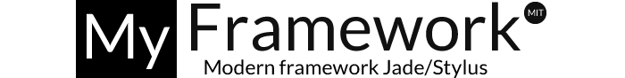

# *My* framework



### Modern framework Jade/Stylus
+ For methodological front ends
+ With Web Accessibility A & AA from W3C
+ With the Usability Heuristics for User Interface Design from Jakob Nielsen
+ With Bower and grunt Integration

---

## ¿Qué es My?

Es un marco de trabajo Html y Css compilado en Jade y Stylus. Utilizar _My_ implica trabajar con una metodología agil y moderna que trae beneficios para el mantenimiento, escalabilidad y desarrollo de los proyectos.

_My_ nace de la necesidad de documentar y estandarizar un framework que permita trabajar de manera modular bajo standars internacionales.

## ¿Por que My?

Se llama _My_ por que se espera que quien lo use se apropie de el y lo haga suyo. Espera ser un marco de trabajo metodologico para desarrolladores front-end que esperan tener un flujo de trabajo moderno.

## Compatibilidad con otros frameworks y/o extensiones

Total compatibilidad con frameworks como Boostrap y Foundation, y con extensiones como Nib.

## Crossbrowsing

Compatibilidad con las ultimas versiones de Google Chrome, Mozilla Firefox e Internet explorer.

> Al ser un framework moderno, no se soporta en versiones de Internet explorer menor a la 10.

## ¿Qué lo hace diferente a otros frameworks?

+ Posee un sistema de grilla flexible basado en el modelo de caja flexible `display flex`.
+ Posee patrones Easing mediante cubic-bezier que permiten usar transiciones CSS3 avanzadas.
+ Mixins integrados con Font-awesome para crear iconos y "social shares" de manera rapida, ya sea desde el html o desde el Css con las pseudoclases `::after` y `::before`.
+ Mixin y variables Html predifinidas mediante Jade
+ Los componentes cumplen con el nivel de conformidad A y AA de accesibilidad web segun la W3C y la NTC5854.
+ Los componentes cumplen con las [10 reglas de usabilidad](http://www.nngroup.com/articles/ten-usability-heuristics/) web del guru de la accesibilidad Jakob Nielsen

## ¿Qué lo hace igual a otros frameworks?

+ Busca generar bloques, bloques de elementos y modificadores de elementos de manera eficiente tanto en Html como en Css.
+ Tiene patrones Css que permiten hacer una arquitectura modular y escalable.
+ Busca generar buenas practicas en el codigo.

## ¿Por que Jade y Stylus?

La respuesta es sencilla. Un código Stylus es muchísimo más sencillo de mantener, con menos horas de trabajo que significa menos costes que un CSS en bruto. Asi mismo un codigo Jade es mas rapido, limpio y eficiente que un Html neto.

Aunque tienen una curva de aprendizaje moderada, se van a encontrar con dos lenguajes de alto nivel, completos y documentados. Es cuestion de acostumbrarse a la identación y a la sintaxis.

Por otro lado, _My_ busca integrarse, en un futuro, con frameworks como expressjs que suelen trabajar con Jade y Stylus.

**Documentación:**

[Sitio oficial Jade](http://jade-lang.com/)
| [Sitio oficial Stylus](http://learnboost.github.io/stylus/)

## Influencias My

### Filosofía DRY

No te repitas o DRY es una la filosofia clave para trabajar de manera modular y escalable...

> El principio No te repitas (en inglés Don't Repeat Yourself o DRY) es una filosofía de definición de procesos que promueve la reducción de la duplicación. Según este principio toda pieza de información nunca debería ser duplicada debido a que la duplicación incrementa la dificultad en los cambios y evolución posterior, puede perjudicar la claridad y crear un espacio para posibles inconsistencias.

**Documentación:**

[Wikipedia](http://en.wikipedia.org/wiki/Don't_repeat_yourself/)

### Flex Layout

Los modelos de caja usado en _My_ no tienen ancho, ni alto fijo. Son cajas flexibles regidas por su contenedor o por su grilla.

> Flexbox proporciona un sistema de diseño adicional a los que ya ofrece CSS. En este nuevo modelo de cajas, los elementos secundarios de una caja se disponen tanto horizontal como verticalmente, y el espacio no utilizado puede asignarse a un elemento secundario específico o distribuirse entre los diferentes elementos secundarios mediante la asignación de "flex" a los elementos secundarios que se deben expandir.

**Documentación:**
 [Chris Coyier](http://css-tricks.com/snippets/css/a-guide-to-flexbox/)
 | [David Walsh](http://davidwalsh.name/stylus-grid/)
 | [Philip Walton](http://philipwalton.github.io/solved-by-flexbox/demos/grids/)

### CSS Guidelines

_My_ esta influenciado por las [CSS Guidelines](https://github.com/csswizardry/CSS-Guidelines/) de Harry Roberts de [CSS wizardry](http://csswizardry.com/).

Harry Roberts dice:

> Yo trabajo bajo OOCSS; Divido los componentes en estructura (objetos) y skin (extension). Como analogía (No ejemplo) observad lo siguiente:

```
.habitación{}

.habitación--cocina{}
.habitación--cuarto{}
.habitación--baño{}
```
> Tenemos diferentes tipos de habitaciones en una casa, pero todas ellas reciben un trato similar; todas tienen suelo, techo, paredes y puertas. Podemos compartir esta información con una clase abstracta '.habitación{}. Sin embargo, tenemos diferentes tipos de habitación que las difieren de otras; la cocina puede tener un suelo de baldosas y el dormitorio puede tener alfombra, un baño puede no tener ventana pero es muy probable que un cuarto si la tenga, y cada habitación puede tener las paredes de diferente color. OOCSS (Object Oriented CSS) nos enseña a abstraer los estilos compartidos en un objeto base y luego extender esta información con clases más específicas que añadan estilo(s) único(s).

> Entonces, en vez de construir docenas de componentes únicos, prueba a identificar patrones de diseño repetidos y abstráelos dentro de clases reusables; construye esqueletos como 'objetos' base y luego enclavija clases a éstos objetos para extender sus estilos en circunstancias más específicas o únicas.

> Si tienes que construir nuevos componentes divídelos en estructura y skin; construye la estructura del componente usando clases muy genéricas de manera que se puedan rehusar y añadirle las clases más específicas para estilizar y añadir diseño.

### Arquitectura CSS

#### BEM (bloque, elemento, modificador)

BEM es una metodología para nombrar y clasificar selectores CSS de manera estricta, transparente e informativa.


__Documentación:__  [Sitio oficial BEM](http://bem.info/)

#### OOCSS (CSS orientado a objetos)

OOCSS es una metodología basada en dos principios:

+ División de los componentes en estructura(layout) y skin(theme). Esta separación de estructura y estilos nos permite trabajar de manera modular con los “skins” que se pueden aplicar a   los diversos módulos u objetos.


+ Separacion del contenedor y el contenido: Se evita el uso de selectores dependientes, por ejemplo `Aside h2 {}`, pues `h2` ya deberia estar definido con sus modificadores.


**Documentación:**

 [Wiki OOCSS](https://github.com/stubbornella/oocss/wiki/)
 | [Blog del Autor](http://www.stubbornella.org/)


#### SMACSS (Arquitectura escalable y modular para CSS)

SMACSS es una arquitectura y filosofía, tambien llamadada guia de estilos, para la estructuración de las hojas de estilos de un proyecto, buscando facilitar la mantenibilidad y flexibilidad, mediante la categorización de los estilos en diferentes archivos.


__Documentación:__  [Sitio oficial SMACSS](http://smacss.com/)


## My Stylus
## My Jade

## My Estructura de archivos

My propone dos entornos de trabajo, uno de desarrollo llamado development donde se almacenan las carpetas y archivos con las que vamos a trabajar

`
-development

-core
 -stylus
  -components
   -buttons.styl
   -forms.styl
   -grid.styl
   -...
-jade
-components
-mixins.jade
-variables.jade
-stylus
-main.styl
-base.styl
-layout.styl
-...SMACSS
-css
-main.css
-libs.css
-jade
-index.jade
-....jade

-production


`
## My Nomenclatura

__Bloque:__ es una entidad independiente. Puede ser visto como un objeto o un modulo. Un ejemplo es el buscador o el header.

```css
.bloque {}
.menu {}
.search {}
```

__Elemento:__  parte de un bloque que cumple una función. Un ejemplo es un input o un button, una imagen o un enlace.

```css
.bloque__elemento {}
.menu__item {}
.search__input {}
```

__Modificador:__  con un modificador se crea un bloque similar a otro existente. Por ej. el activo de un menú.

```css
.bloque--modificador {}
.menu--activo {}
.search--error {}
```

Los bloques y elementos buscan tener selectores únicos. Si el bloque es `.menu`, un elemento se llamaria `.menu__item` y un modificador sería `.menu__item–-activo`.

```css
.bloque {}
.bloque__elemento {}
.bloque--modificador {}
```

## My Metodologia

__Ejemplo__

__Jade__

```jade
ul.menu.menu--left.menu--blue
 li:a(href="#") Inicio
 li:a(href="#") Quíenes somos
...
```

__Html__

```html
<ul class="menu menu--left menu--blue"
 <li><a href="#">Inicio</a>
 <li><a href="#">Quíenes somos</a>
 ...
</ul>
```

__Stylus__

```css

MyBlue = #1e6ce2

.menu
 .menu--left
  float left

 .menu--blue
  color MyBlue
```

__Css__

```css
.menu {}
.menu .menu--left {float: left;}
.menu .menu--blue {color: #1e6ce2;}
```

__Ejemplo__

__Jade__

```html
aside
 h2.modificador
```
__Stylus__

```css
h2 {}
h2.modificador {}
aside {}
```

##My Estructura de archivos

SMACSS define cinco categorías o archivos que apropia __My__:

**Base:**
En esta categoría se incluyen los estilos base de nuestro proyecto, incluyendo reset o el Normalize.css, tipografías y márgenes básicos de todo el sitio.

__Ejemplo__

__Stylus__

```css
color1 = #01DFFD
color2 = color1 * 2

body
form
 margin 0
 padding 0

a
 color color1
 &:hover
  color color2
```

__Css__
```css

 body, form {
    margin: 0;
    padding: 0;
}

a {
    color: #039;
}

a:hover {
    color: #03F;
}
```
**Module:**
Los módulos son todos aquellos componentes reutilizables e independientes, lo que en BEM serian los bloques o los componentes en OOCSS.

__Ejemplo__

__Stylus__

```css
.module
 h2
  padding 5px
 span
  padding 15px
```

__Css__
```css

.module > h2 {
    padding: 5px;
}

.module span {
    padding: 5px;
}
```

**State:**
Son los modificadores de los elementos, las reglas de estado son todas aquellas que determinan como se verá un módulo, cuando se encuentra en un estado en específico.

__Ejemplo__

__Stylus__

```css
.error
  background-color red
  color white

.is-tab-active
  background-color white
  color black
```

__Css__
```css
.error {
    background-color: red;
    color: white;
}

.is-tab-active {
    background-color: white;
    color: black;
}
```

**Layout:**
Hoja de estilos con las reglas que definen los contenedores y la grilla.

__Ejemplo__

__Stylus__

```css

anchoBox = 960px

header
article
footer
  width anchoBox
  margin auto

.article-left
    @import article
    border solid color2
    border-width 1px 0 0
```

__Css__
```css
header, article, footer {
    width: 960px;
    margin: auto;
}

.side-left {
    border: solid #CCC;
    border-width: 1px 0 0;
}
```

**Theme:**
Es lo que en OOCSS seria el _Skin_, en esta hoja se almacenan los colores, formas y tamaños.

__Ejemplo__

__Stylus__

```css
.borderSlider
  border 1px solid

.borderSliderblue
    border-color color1
```

__Css__
```css
.borderSlider {
    border: 1px solid;
}

.borderSliderblue {
    border-color: blue;
}
```

## Automatización de tareas

###Bower

###Grunt

###Yeoman (PROXIMAMENTE)

